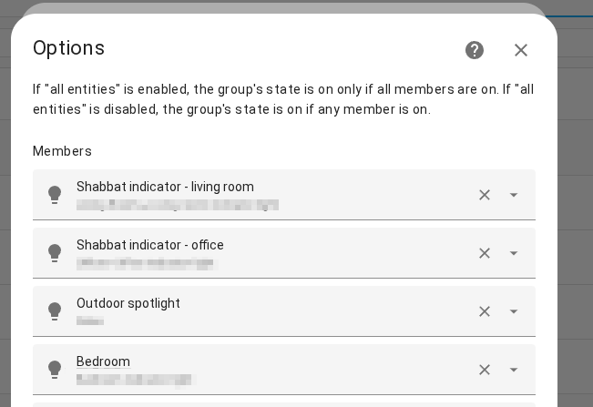

# Red Alert Home Assistant Updated Templates (May 2025)

## Table of Contents
- [Overview](#overview)
- [Updated Alerts](#updated-alerts)
- [Combined Downstream Sensor](#combined-downstream-sensor-optional)
- [Automation Templates](#automation-templates-here)
- [Other Setup Details](#other-setup-details)
- [Enhancements](#enhancements)

## Overview

This repository contains updated automation templates for handling red alerts in Home Assistant. 

These automation templates are based on the enhanced early warning system issued by the **Home Front Command** and integrated via the [Oref Alert integration](https://github.com/amitfin/oref_alert) maintained by Amit Finkelstein which allows the alerts to be integrated into Home Assistant.

### Updated alerts

In `Oref Alert` the active red alert state (once configured for your instance's geolocation) is implemented as:

`binary_sensor.oref_alert`

Set triggers on state = `unsafe`

The new (May 2025) preemptive update which sends a few minutes before the actual emergency siren system activates has been implemented as:

`binary_sensor.oref_alert_preemptive_update`

### Combined Downstream Sensor (optional)

For convenience, you may wish to create a template sensor which is downstream of the plugin integration and turns to `unsafe` when either the actual or preemptive alerts are `active` like this:

```yaml
oref_any_alert:
    friendly_name: "Any Oref Alert"
    value_template: >
          {{ is_state('binary_sensor.oref_alert', 'on') or is_state('binary_sensor.oref_alert_preemptive_update', 'on') }}  
```

### Automation Templates Here

I currently use the following to notify of events:

- Zigbee sirens (to cover inner rooms where exterior sirens may not be audible)  
- RGB lights  
- Normal lights  

#### Available Automations

| Automation | Description | File |
|------------|-------------|------|
| Red Alert - Activate Sirens and Flash Lights | Triggers multiple sirens and flashes alert lights when a red alert is active | [red-alert-active.yaml](automations/red-alert-active.yaml) |
| Red Alert - Early Warning Notification | Sends alert and flickers status lights for 2 minutes when an early warning is received | [early-warning-notifier.yaml](automations/early-warning-notifier.yaml) |
| Red Alert Cleared | Turns indicator light green briefly and sends all-clear notifications | [alert-over.yaml](automations/alert-over.yaml) |

Frequently (in Jerusalem) the alerts have been happening at all hours of the day and night. 

So the preemptive alert is particularly useful for the unpleasant but necessary task of turning on the bedroom lighting to rouse oneself from sleep. 

For RGB lighting: I bought some Zigbee RGB E27s and a few fixtures in IKEA and placed one in each room to have a visual fallback in case I was playing music when the alerts go off (it happens!).

## Other Setup Details

For convenience, I created a `Red Alert Lights` lighting group that bundles together the RGB lights so that they can all be set to the warning colors (orange = preemptive; red = active) simultaneously.



I created a second group called `red alert activation lights` that includes both this set of lights and those that don't have RGB. The ability to nest groups in this manner in HA is very helpful.


### Enhancements

- TTS readout 
- Integrate automated X lookup to notification warning with a system prompt like: "in the last few minutes a Red Alert was activated in {your area}. Who's firing things?